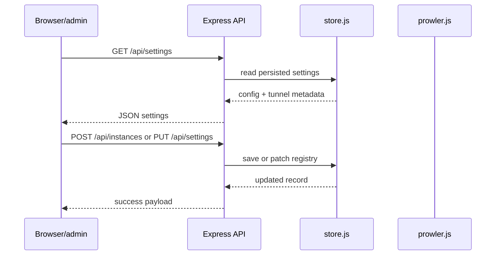
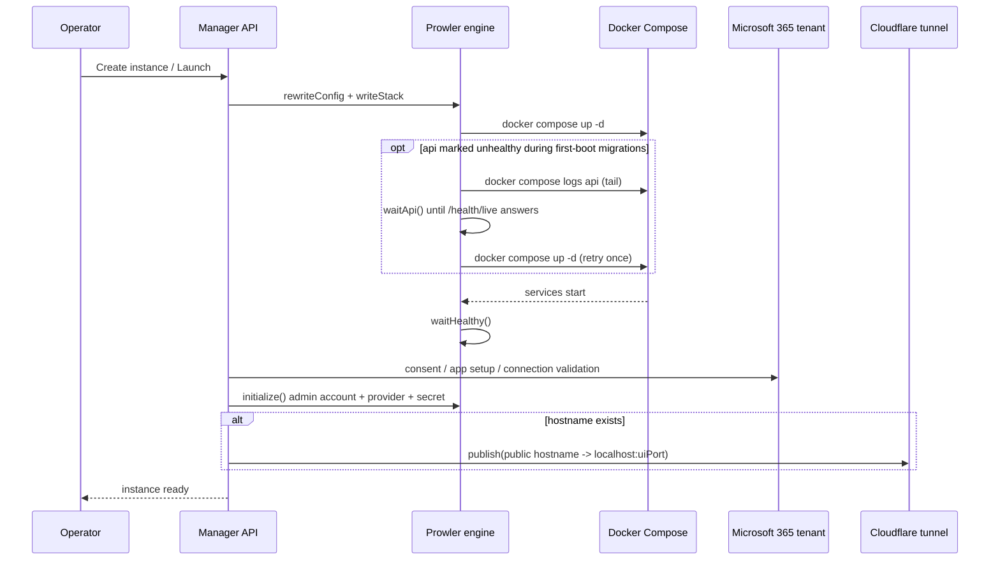
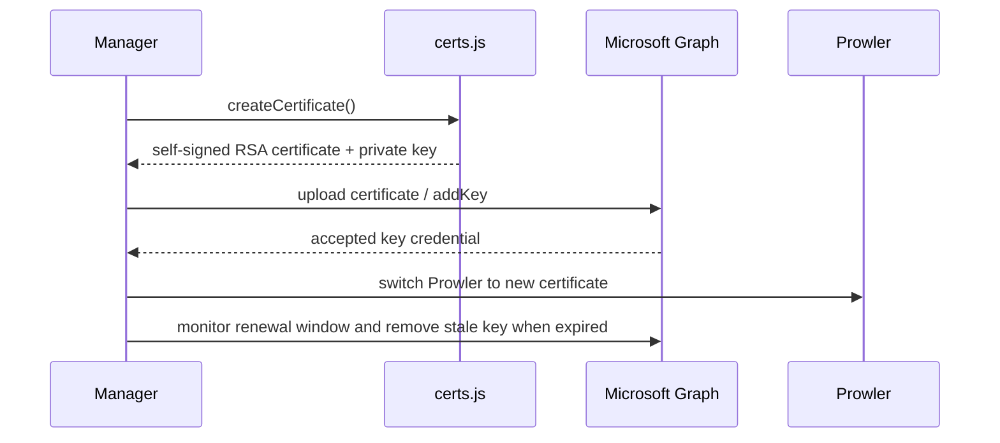
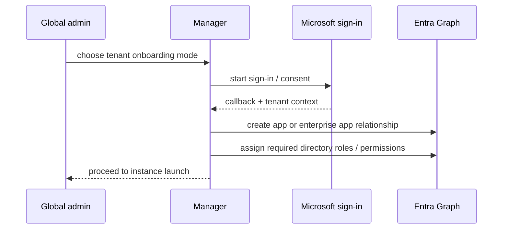
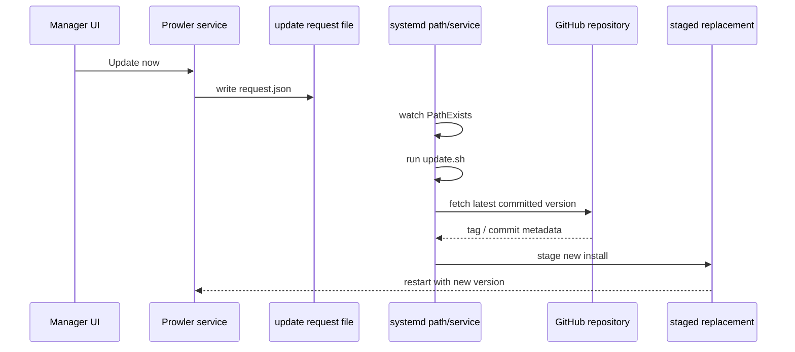

# Application Flow

This document tracks the major runtime flows implemented in the codebase.

## 1. Manager startup and API bootstrap
The Express app is created in [src/server.js](../src/server.js) and starts with the selected host and port. It binds static assets from [public/](../public), serves the dashboard, and defines routes for settings and instance operations. The OAuth callback path is also mounted here so Microsoft sign-in can redirect back into the manager.

## 2. Creating and launching an instance
The instance flow is orchestrated in the `launch` function in [src/server.js](../src/server.js). It prepares bootstrap material for certificate-based auth, rewrites the instance environment, runs Docker Compose, waits for health endpoints, ensures consent or certificate readiness, initializes Prowler, and then publishes the instance through Cloudflare if a hostname is configured.

## 3. Certificate bootstrap and renewal
Certificate generation and Graph operations are in [src/certs.js](../src/certs.js), while the renewal logic is in [src/renewal.js](../src/renewal.js). The sequence below describes the standard certificate lifecycle:

## 4. Tenant onboarding and consent flow
The onboarding flow is implemented in [src/onboarding.js](../src/onboarding.js) and [src/msp.js](../src/msp.js). It supports direct app creation, MSP app flows, and device-code fallbacks when the Graph Command Line Tools public client is used.

## 5. Update flow
The self-update mechanism is represented by [src/updater.js](../src/updater.js) and the root-owned systemd units in [deploy/prowler-manage-update.path](../deploy/prowler-manage-update.path) and [deploy/prowler-manage-update.service](../deploy/prowler-manage-update.service). The logic is designed to avoid in-place mutation while the service is running and to switch to a staged replacement when the update succeeds.

