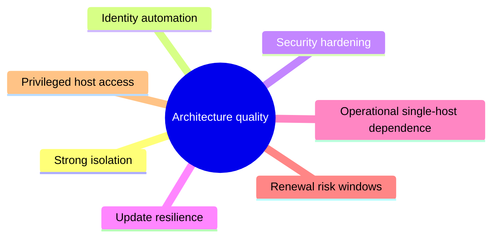

# Architecture Review

This review traces the actual implementation in the repository rather than the project description alone. It is grounded in [README.md](../README.md), [src/server.js](../src/server.js), [src/prowler.js](../src/prowler.js), [src/renewal.js](../src/renewal.js), [src/certs.js](../src/certs.js), [src/secrets.js](../src/secrets.js), and the install/update units under [deploy/](../deploy).

## Positive architectural traits

### Strong isolation per tenant
Each instance is deployed as an isolated stack with its own Compose project and its own port bindings. This is implemented in the `buildOverride` and `compose` functions in [src/prowler.js](../src/prowler.js). The design reduces shared-state risks and makes it practical to run many customer tenants on one host.

### Explicit security boundaries
The project treats certificate keys as a critical secret. [src/secrets.js](../src/secrets.js) provides encrypted at-rest behavior and the service unit in [deploy/prowler-manage.service](../deploy/prowler-manage.service) hardens the process with `ProtectSystem`, `ProtectHome`, `PrivateTmp`, and `NoNewPrivileges` among other settings. This is consistent with an operations-focused host model.

### Operational resilience
The manager supports retry logic, health checks, and renewal resumption. Examples include the `launch` retry in [src/server.js](../src/server.js), the health waiters in [src/prowler.js](../src/prowler.js), and the recovery-oriented certificate flow in [src/renewal.js](../src/renewal.js).

### Update safety
The system uses staged updates and rollback logic under Linux. This is described in [README.md](../README.md) and implemented via the root-owned service files in [deploy/](../deploy). That is a strong pattern for self-hosted operational software.

## Architectural risks and caveats

### File-based registry is a single-host dependency
The application uses local JSON state instead of a database. [src/store.js](../src/store.js) is simple and effective for a single manager host, but it means the manager’s operational state is bound to the local filesystem and the machine running it.

### Certificate lifecycle is complex and brittle if downtime occurs
The certificate renewal model is carefully designed but depends on the manager remaining available during the renewal window. This is explicitly documented in [README.md](../README.md): the manager must run to register new keys before expiry. That is a true operational dependency and should be treated as such.

### Docker access is privileged by design
The service user is a member of the Docker group and the systemd unit accounts for this in [deploy/prowler-manage.service](../deploy/prowler-manage.service). This makes the manager powerful, but it means the host and its service account must be treated as privileged operational trust boundaries.

### External exposure relies on Cloudflare Access discipline
The README explicitly warns that without Cloudflare Access, the manager can expose admin credentials and instance state if the hostname is reachable without protection. This is an important operating control, not just a configuration footnote.

## Review summary

The architecture is pragmatic and production-oriented for self-hosted multi-tenant administration. It favors security boundaries, explicit automation, and systemd-based operations over complex distributed services. The trade-off is that the platform is operationally powerful, but it is not cloud-native or horizontally distributed by default.

