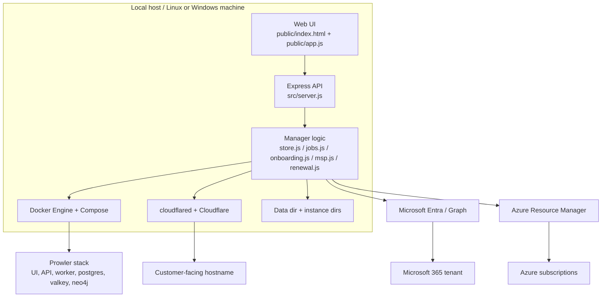

# Architecture Overview

This repository implements a locally hosted manager for many Prowler App instances. The manager is the control plane; each Prowler instance is an isolated Docker Compose project. The application entrypoint is [src/server.js](../src/server.js), the instance deployment logic lives in [src/prowler.js](../src/prowler.js), and the JSON state registry is in [src/store.js](../src/store.js).

## System context

The system manages three major concerns:

1. instance lifecycle management;
2. Tenants and identity operations through Microsoft Entra / Microsoft Graph;
3. external publication through Cloudflare.

## Core components

### 1. API and web interface
The app runs an Express server with static file hosting and endpoint handlers for settings, instance CRUD, login flows, and updates. The main router is in [src/server.js](../src/server.js). It binds to `HOST` and `PORT` values and exposes views like `/api/instances`, `/api/settings`, and tenant onboarding callback endpoints.

### 2. Instance lifecycle engine
[ src/prowler.js ](../src/prowler.js) is the actual deployment engine. It downloads upstream Prowler Compose files from GitHub, writes environment variables, creates a per-instance override file, and runs Docker Compose operations. Each instance is rendered as a project name like `prowler-${slug}` and uses loopback-only ports stored on the host.

### 3. State persistence
The application stores state in JSON files rather than a database. [src/store.js](../src/store.js) centralizes access to settings and instance records. This model allows the manager to survive restarts while retaining instance configuration, app registration metadata, and certificate state.

### 4. Identity and certificate automation
Multi-tenant Microsoft Entra integration is implemented in [src/msp.js](../src/msp.js), [src/onboarding.js](../src/onboarding.js), and [src/certs.js](../src/certs.js). The system can create app registrations, accept consent, assign directory roles, generate self-signed certificates, and auto-renew them using Graph `addKey` and `removeKey` calls.

Azure subscription onboarding is implemented in [src/azure.js](../src/azure.js). An admin signs in to the customer tenant with a delegated Azure Resource Manager token (Azure CLI public client). The manager then creates or updates the custom `ProwlerRole` and assigns `Reader` and `ProwlerRole` to the instance app's service principal on every enabled subscription. Finally it registers each subscription as an `azure` provider in Prowler through [src/prowler.js](../src/prowler.js). Prowler's Azure provider only accepts a client secret. For certificate and MSP instances the manager adds one with Graph `addPassword` (the app acting on itself) and rotates it from the renewal scheduler in [src/renewal.js](../src/renewal.js).

### 5. Runtime supervision and updates
The manager supports self-update and self-healing for its own process. [src/updater.js](../src/updater.js) manages version detection and update checks, and the Linux service files in [deploy/](../deploy) orchestrate root-run updates via systemd path/service units.

## Runtime assumptions

The design assumes a single trusted host machine is running the manager, Docker, and Cloudflare tunnel software. That host is responsible for container control, network exposure, and secure key storage. The repository treats that machine as the operational boundary and not as a stateless cloud deployment.

## Non-detected architecture elements

No Azure deployment or Terraform/Bicep files are present in this repository. The system calls Microsoft Entra, Microsoft Graph and, for Azure subscription onboarding, Azure Resource Manager (role definitions and role assignments only). It does not define Azure infrastructure as code.
