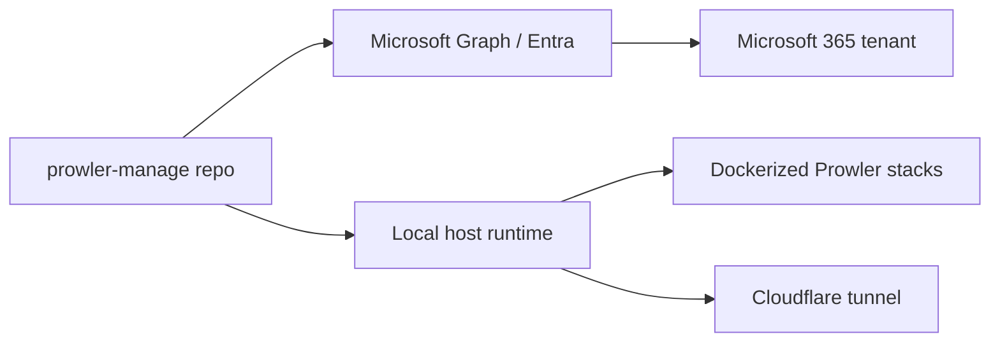

# Azure Architecture Note

No Azure resource definitions or Azure infrastructure-as-code files were found in this repository. The application does not define Azure App Service, Azure Container Apps, Azure Functions, Virtual Machines, or network resources in code or deployment manifests.

The repository instead interacts with Microsoft Entra ID and Microsoft 365 APIs through Graph calls, which are implemented in [src/certs.js](../src/certs.js), [src/onboarding.js](../src/onboarding.js), [src/msp.js](../src/msp.js), and [src/renewal.js](../src/renewal.js). Those calls authenticate to Microsoft 365 tenants and manage application registrations, not Azure-hosted workloads.

This means the repository is best understood as a self-hosted Microsoft 365 operations manager, not as an Azure-deployed application. The Azure platform is used as an external identity and directory service, not as the hosting environment for the app itself.

