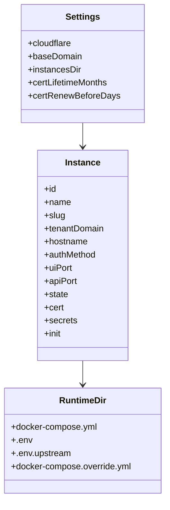

# Data Model and Persistence

This project does not use a database server. Instead, it persists operational state as local JSON files and generated runtime directories. The central state model is defined in [src/store.js](../src/store.js), and the environment and instance persistence rules are described in [README.md](../README.md) and [src/prowler.js](../src/prowler.js).

## Persistent state

The application stores:

- settings, such as Cloudflare configuration, base domain, and certificate windows;
- instance definitions and lifecycle status;
- tenant and app metadata;
- certificate records and encrypted private material.

The runtime uses the `PROWLER_MANAGE_DATA` and `PROWLER_MANAGE_INSTANCES` paths from environment variables and falls back to local defaults. The data layout is described in [README.md](../README.md) and the service unit in [deploy/prowler-manage.service](../deploy/prowler-manage.service).

## Instance directory model

Each instance has its own directory under the instances root. [src/prowler.js](../src/prowler.js) writes:

- `docker-compose.yml` from the upstream Prowler project;
- `.env.upstream` from the upstream environment;
- a generated `.env` with secrets and environment values;
- `docker-compose.override.yml` for loopback-only host bindings and health-check tuning.

This model keeps each tenant’s state and service config isolated while still allowing the manager to operate many instance stacks side by side.

## Data model conclusion

The design favors local persistence, isolation, and operational simplicity over central DB coordination. That fits a single-host controller but is not a distributed multi-node system model.
