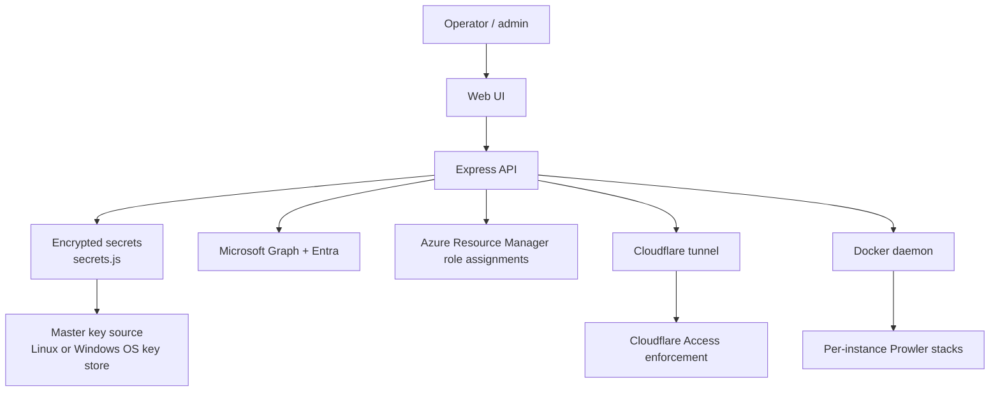

# Security Architecture

The codebase reflects a security-first operational mindset. The principal controls are key protection, service hardening, Cloudflare access enforcement, and least-privilege identity flows.

## Key protection

At-rest key protection is implemented in [src/secrets.js](../src/secrets.js). On Linux, the project uses AES-256-GCM with a 32-byte master key; on Windows, it relies on DPAPI for the active user account. This is confirmed by the certificate sealing logic in [src/certs.js](../src/certs.js).

The README explicitly documents the key source precedence in Linux: systemd credentials, root-only file, service-user-readable file, and the development fallback in `data/master.key`. This is described in [README.md](../README.md).

## Service hardening

The service unit in [deploy/prowler-manage.service](../deploy/prowler-manage.service) disables several system-level privileges and isolates the process. It runs under a dedicated service user, restricts file access, uses `ProtectSystem=strict`, and sets `PrivateTmp=true`, `ProtectHome=true`, and `NoNewPrivileges=true`.

## Tenant access model

The manager supports different tenant connection models in [src/server.js](../src/server.js), [src/onboarding.js](../src/onboarding.js), and [src/msp.js](../src/msp.js):

- MSP app model;
- dedicated customer app; 
- existing app registration.

Each mode is designed to require explicit consent and to assign roles such as Global Reader only after approval. Default patterns are described in [README.md](../README.md).

## Azure subscription access

Azure onboarding ([src/azure.js](../src/azure.js)) needs an admin's delegated Azure Resource Manager token with Owner or User Access Administrator on the subscriptions. Like the other sign-in tokens, it lives only in memory for the duration of the flow. The app's service principal receives only `Reader` and the custom `ProwlerRole`, which adds two read actions on App Service (`Microsoft.Web/sites/host/listkeys/action`, `Microsoft.Web/sites/config/list/Action`), per Prowler's documented requirements.

Prowler's Azure provider only accepts a client secret. For certificate and MSP instances the manager adds a password credential to the app registration through the app's own `Application.ReadWrite.OwnedBy` permission. The secret text goes straight to Prowler and is never written to the manager's disk. Only its key ID and expiry are stored, so it can be rotated before expiry and removed when the instance is deleted. For MSP instances these passwords sit on the shared MSP app, one per instance, so the MSP app's credential list grows with the number of Azure-connected instances. A client secret typed in for a secret-based instance is held in memory only until the flow ends.

## Cloudflare access

The manager uses Cloudflare as an ingress and strongly warns that the service itself is not protected by login unless Cloudflare Access is configured. The app detects Cloudflare headers and surfaces a red warning when the manager is reached without Access. The relevant logic lives in [src/server.js](../src/server.js) and the operational guidance in [README.md](../README.md).

## Security conclusions

This repository deliberately treats the host as a privileged environment. The trust boundary is the machine running the manager, Docker, Cloudflare tunnel, and the master key source. As long as that boundary is controlled, the design is robust for managed multi-tenant operations.

